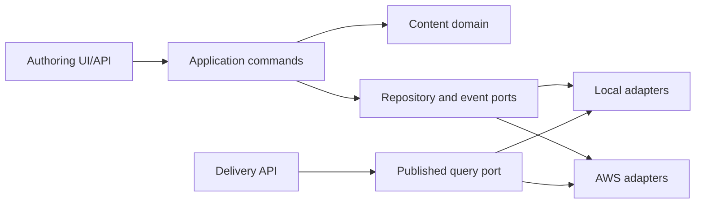

# Architecture spine

> Superseded as the full AWS topology by the [Day 1 architecture approval packet](../../../../docs/architecture-approval.md). The domain invariants below remain proposals until the owner approves the packet.

## Design paradigm

Hexagonal core: domain rules and application commands have no AWS SDK dependency. Adapters implement repositories, event delivery, API transport and identity. Publish is an event-driven workflow, but the authoritative publication state is the Published Snapshot pointer, not an event consumer's projection.



## Invariants and rules

### AD-1 — One language-neutral Content Item

- **Binds:** FR-1, FR-2, FR-7.
- **Prevents:** Independently created translations being impossible to relate or migrate.
- **Rule:** Every Locale Variant has `(contentId, locale)` identity. `contentId` is stable across locales; each locale owns independent draft and published pointers.

### AD-2 — Immutable Revision chain

- **Binds:** FR-4, FR-5.
- **Prevents:** Lost edits and history that changes underneath an audit or publish.
- **Rule:** Save/restore creates a new Revision. Advancing the Draft Revision pointer uses an expected-revision condition; stale writes return conflict. Never overwrite a Revision.

### AD-3 — Published isolation

- **Binds:** FR-6, FR-7, NFR-1.
- **Prevents:** Draft leakage and public responses changing when an Author edits.
- **Rule:** The Delivery API can read only Published Snapshots. Publish copies one selected Revision into an immutable snapshot and advances only that locale's published pointer. No locale fallback in v1.

### AD-4 — Durable, idempotent Publish Event

- **Binds:** FR-8, NFR-3.
- **Prevents:** A committed publish with no event, or duplicate downstream effects on retry.
- **Rule:** Record publish state and an event-outbox entry in one durable transaction when the chosen store supports it; a dispatcher sends the event to EventBridge/SQS. Consumers deduplicate by stable event/publish ID. Do not claim exactly-once delivery. The outbox implementation is a Day 6 design detail, but this atomicity contract is fixed.

### AD-5 — Storage-agnostic domain model

- **Binds:** FR-1–FR-8, NFR-4.
- **Prevents:** AWS resource names, table keys or transport envelopes becoming the portable content schema.
- **Rule:** Domain objects use canonical UUIDs and schema-versioned JSON. AWS persistence and API DTO mapping live in adapters. Binary assets live outside Revision JSON; Revisions carry Asset References.

### AD-6 — Command/query and trust boundary

- **Binds:** FR-6, FR-7, FR-9.
- **Prevents:** Public readers gaining draft access through a shared route or permission shortcut.
- **Rule:** Authoring commands require role checks at the API boundary; Delivery API exposes published read-only queries. Tests exercise authorization before storage access. Identity-provider choice is deferred; authorization semantics are not.

### AD-7 — Local-first proof, optional cloud deployment

- **Binds:** FR-10, NFR-5.
- **Prevents:** Product validation depending on a paid AWS account or one developer's credentials.
- **Rule:** The demo and behavioral tests run locally. Terraform defines the optional AWS slice; no live deployment occurs without a selected account, region, budget and explicit go-ahead.

## Consistency conventions

| Concern | Convention |
| --- | --- |
| IDs | Canonical UUID strings; no AWS ARN, S3 key or DynamoDB partition key in content exports |
| Locale | `en` and `fr` for v1 pending user confirmation; exact match, no fallback |
| Timestamps | ISO 8601 UTC with `Z` |
| Schema evolution | `schemaVersion` on content and event payloads; incompatible change requires a new version |
| Error mapping | validation → 400, unauthenticated → 401, forbidden → 403, absent/unpublished → 404, stale revision → 409 |
| Logging | Correlation ID and record IDs, not draft body, credentials or raw asset bytes |

## Structural seed

```text
src/domain/          canonical entities, invariants, pure validation
src/application/     authoring commands and publishing use cases
src/ports/           repositories, event dispatcher, identity interfaces
src/adapters/local/  local persistence and event harness for tests/demo
src/adapters/aws/    DynamoDB, S3, EventBridge/SQS, Lambda adapters
src/api/             authoring and delivery transport mapping
web/                 thin authoring editor, if Day 8 remains in scope
infra/               optional Terraform AWS slice
```

The AWS mapping is a seed, not yet a live deployment decision. DynamoDB is intended for metadata/revisions/pointers and S3 for binaries. EventBridge and SQS provide an extension seam; Lambda processes commands and events. AWS’s [DynamoDB optimistic locking guidance](https://docs.aws.amazon.com/amazondynamodb/latest/developerguide/BestPractices_OptimisticLocking.html) supports conditional revision-pointer updates. [SQS-triggered Lambda](https://docs.aws.amazon.com/lambda/latest/dg/with-sqs.html) is at-least-once, which motivates AD-4. [S3 presigned URLs](https://docs.aws.amazon.com/AmazonS3/latest/userguide/using-presigned-url.html) are an optional asset-transfer mechanism; object keys must be unique because an upload can replace an existing key.

## Deferred

- Runtime/framework versions and exact TypeScript starter: choose on Day 2 after checking current supported versions and test tooling.
- DynamoDB table/index access patterns and outbox implementation: design on Days 3–6 against actual queries and failure tests.
- Identity provider (Cognito or alternative): role semantics are fixed, provider integration is not needed for local proof.
- CloudFront/WAF, OpenSearch, Bedrock, Step Functions, VPC design and multi-region DR: no current MVP requirement warrants their cost/complexity.
- Multi-site tenancy, locale fallback, scheduled publishing, deletion/retention policy, production SLOs: require product policy before architecture.

## Open questions

1. Confirm generic `en`/`fr` versus region-specific locale codes before Day 2 schema freeze.
2. Confirm independent per-locale publication before Day 5.
3. Supply AWS account, region and spend cap before considering Day 7 live deployment.
