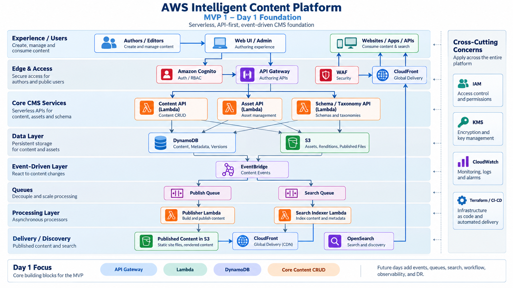
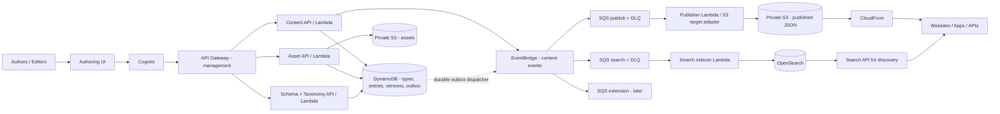

# Architecture baseline

This is a text reconstruction of the [latest shared architecture discussion and generated diagram](https://chatgpt.com/share/6aa82bd1-34ec-83e9-8c8c-8ec50eaebad3), refined into an implementation contract. It supersedes the prior Article-first, service-bingo approval packet. The generated image names the same management, event and delivery layers. The project owner approved this architecture on 2026-09-14; approval does **not** imply AWS deployment.

The PNG above is the original generated diagram, preserved unchanged. It is conceptual: the implementation contract below makes publish-intent durability, queue retries and the management/delivery trust boundary explicit rather than treating every drawn arrow as a direct AWS integration.

## Core topology

IAM, KMS, CloudWatch, Terraform/CI and optionally WAF apply across the relevant boundaries. The generated image depicts WAF at the edge; the ten-day plan treats its configuration as a security decision rather than allowing it to displace core work. In the image, Content, Asset and Schema/Taxonomy APIs are separate Lambda responsibilities, **not** a mandate for dozens of microservices.

## Invariants to build against

| ID | Rule | Consequence |
| --- | --- | --- |
| AD-1 | The core knows `ContentType`, `ContentEntry`, fields and references—not Article, Product, Mortgage Offer or any industry noun. | Industry examples are schema/configuration data. Day 5 must create three types with no core-code branch. |
| AD-2 | Every major record carries tenant/site scope; MVP runs one tenant. Locale, Channel and PublishTarget are explicit concepts or ports. | No hard-coded Bell tenant or website-only/publish-to-S3-only domain API. Full multi-tenancy and extra adapters are later. |
| AD-3 | Authoring/management and public delivery are separate planes. | Editors use authenticated API Gateway/Lambda/DynamoDB. Readers get published JSON from CloudFront/S3 and do not load the management API at scale. |
| AD-4 | DynamoDB is authoritative for content state and versions. S3 holds binaries and published projections; OpenSearch is a rebuildable search projection. | Losing an index cannot lose content. Drafts never appear in public S3. |
| AD-5 | Publishing is async and at-least-once. Persist publish intent with the content-state change before emitting events. | EventBridge fans out to isolated SQS consumers. Workers are idempotent; retries and DLQs are exercised, not hand-waved. |
| AD-6 | Basic version history is immutable. A content update creates a new version with conditional pointer advancement. | Stale writes fail explicitly; restore creates a new version. Advanced editorial workflow is postponed until Day 8. |
| AD-7 | Domain models and ports do not embed ARNs, S3 keys, DynamoDB partition keys or OpenSearch documents. | AWS adapters can change without changing the canonical content contract. |

The event vocabulary is defined early so extensions can subscribe without changing core code: `ContentCreated`, `ContentUpdated`, `ContentSubmitted`, `ContentApproved`, `ContentPublished`, `ContentUnpublished`, `AssetUploaded` and `SchemaUpdated`. MVP 1 needs working publication events; other event types are added only when their corresponding action exists. The EventBridge envelope is versioned and carries tenant/site and entry identity, event ID and occurrence time.

## Model boundary

Use the [generic model](generic-content-model.md). Day 1 creates a generic envelope with `tenantId`, `siteId`, `contentType`, `locale`, `status`, `version` and arbitrary `fields`; full field-definition validation is Day 5. The existing Article fixtures are legacy illustrative examples, **not** the core schema. The model is single-tenant in operation but tenant/site-scoped in identity and data access.

## SAA-C03 learning focus

The implementation deliberately exercises API Gateway, Lambda, DynamoDB, S3, CloudFront, EventBridge, SQS/DLQ, OpenSearch, Cognito, IAM, KMS, CloudWatch and Terraform. Scale, throttling, retries, eventual consistency, cost and DR are explored using this actual architecture. EC2/ECS/RDS are alternatives to defend, not extra production dependencies. The earlier [broad service matrix](saa-c03-service-coverage.md) is now a core-vs-comparison guide, not a nine-day deployment checklist.

## Open execution inputs

- AWS account/profile and region for the Day 1 deployment.
- Maximum permissible AWS spend, especially OpenSearch on Day 6.
- Whether to use the CloudFront default domain or an owned domain; no DNS change is assumed.
- Generic locale code policy and first demo industry configuration.

These inputs gate corresponding deployments, not the validity of the approved generic architecture.
