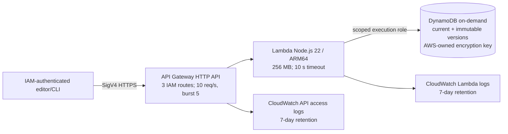

# Day 1 implementation and SAA-C03 review — 2026-09-14

Status: **PASS for the Day 1 generic authoring slice**. The owner approved the [target architecture](../architecture-approval.md); this record describes the smaller architecture actually deployed. The Day 1 build was subsequently migrated from Python to Node.js 22 at the owner's request, then redeployed and reverified. LocalStack was explicitly skipped.

## As-built architecture and boundaries

Only the management plane exists today. There is no public delivery endpoint, Cognito, EventBridge, SQS, S3, CloudFront or OpenSearch yet. The approved target diagram shows those later components, not current resources. The client-supplied `tenantId` and `siteId` are included in the DynamoDB key and checked on reads/updates, but **are not an authorization boundary**; Day 7 must derive scope from authenticated claims. Draft entries are accessible only through IAM-signed management routes.

## Implementation inventory

- Application: `src/content-api/handler.js` maps three HTTP API routes; `service.js` validates a generic content envelope and version rules; `repository.js` stores a `CURRENT` pointer and immutable `VERSION#...` snapshots in one DynamoDB transaction. No article/product branches exist.
- Tests and tools: `tests/content-api.test.js` has five dependency-free Node tests. `scripts/smoke-day1.js` signs live HTTPS requests using temporary credentials exported by AWS CLI. `scripts/terraform_day1.ps1` uses a fresh scoped role session. `package.json` and lockfile pin the local workflow; no npm runtime package is included in the Lambda ZIP.
- Infrastructure: `infra/day1/main.tf`, variables, outputs and provider lockfile. The final stack has **13 Terraform resources**: HTTP API, default stage, three routes, Lambda integration and invoke permission, Node Lambda and its execution role/policy, DynamoDB table, and two CloudWatch log groups.
- IAM/bootstrap: `cms-dev` uses temporary AWS CLI browser-login credentials for IAM user `Hakim`; `cms-deploy` assumes `IntelligentCmsDay1DeployRole`. The `hakim` root profile was used only to establish/update the scoped role, never for Terraform deployment. MFA was deferred explicitly by the owner.
- Data: the final Node smoke created a demo product `43a57c19-6f4f-4b5b-82e3-7199eaa1cf12` and article `45a40dbb-ff85-4f3a-807e-9467ca6e33cf`. The product reached version 2. Prior smoke records remain as demo data.

## Verification evidence

| Check | Result |
| --- | --- |
| `npm test` | **5/5 passed** on local Node.js 24; code targets AWS `nodejs22.x`. |
| `node --check` for source and smoke script | Passed. |
| `terraform fmt -check` and `terraform validate` | Passed with Terraform v1.16.2. |
| Terraform migration plan and final drift check | No destroy; existing function changed in place, table encryption enabled, API access log group added, stage throttling/logging updated. Final live plan: **No changes**. |
| Live signed Node smoke | **PASS**: create/read `product` and `article`; update version 1 → 2; stale expected version 1 → HTTP 409. |
| Anonymous POST | HTTP 403 after the Node.js migration; all three route definitions specify `AWS_IAM`. |
| Lambda diagnostics | Scoped role can read project logs; fixed ES-module ZIP boundary and handler callback collision found during smoke. |
| Live configuration | Lambda `nodejs22.x`, ARM64 and Active; DynamoDB on-demand, Active and SSE Enabled; API rate 10/s, burst 5; structured access-log delivery confirmed with 200 and 409 entries. |

The endpoint is `https://fokte33w34.execute-api.ca-central-1.amazonaws.com/`. The final plan/drift check is recorded after the final code deployment. Terraform state is local and ignored; another contributor must not independently apply or destroy this stack before an encrypted shared backend with locking is configured.

## SAA-C03 architecture gate

| Domain | Decision, project evidence, and trade-off | Same-day remediation / boundary |
| --- | --- | --- |
| Secure architectures | API routes use `AWS_IAM`; Lambda has table-specific read/transaction-write and log-stream permissions; operator role is scoped to Day 1 names/Region. DynamoDB server-side encryption is explicitly enabled with an AWS-owned key. IAM is not tenant authorization. | Verified unsigned 403; added explicit encryption and scoped log-read permission. Cognito-derived tenant scope is a Day 7 dependency. MFA remains owner-deferred and is a security risk, not a passed production control. |
| Resilient architectures | DynamoDB stores current and version snapshots atomically; conditional writes reject stale updates. The managed API/Lambda/DynamoDB path avoids managing servers, but a single Region and local Terraform state are recovery limits. | Verified stale-write 409 and immutable snapshots in tests. Shared encrypted/locked state is a team prerequisite before a second operator deploys. PITR and a restore drill belong to Day 9; no production RTO/RPO claim is made. |
| High-performing architectures | On-demand DynamoDB avoids provisioned-capacity guesswork; HTTP API and Lambda scale independently. API stage throttles to 10 requests/s with burst 5 to limit demo abuse. Keys contain tenant/site/entry, though hot-tenant patterns need review under load. | Added API throttling. Attempted Lambda reserved concurrency of 5, but AWS rejected it because this account's unreserved concurrency would drop below its mandatory minimum of 10. Removed the unsupported reservation; monitor the account quota and use Day 4's bounded load/back-pressure test. This stack is not claimed to sustain 1M authoring requests at present. |
| Cost-optimized architectures | HTTP API, Lambda and DynamoDB on-demand have usage-based costs; API/Lambda logs retain 7 days. ARM64 is used for the Node Lambda. No idle OpenSearch, NAT gateway, container service or public delivery stack is provisioned. | Added short log retention and API throttle. The owner's USD $10/month target is **not a billing hard cap**; verify Cost Explorer/Budgets before Day 2 or any expensive resource. A pre-deployment Cost Explorer read was approximately zero but may lag. |

## SAA-C03 scenario questions and reasoned answers

1. **Security — An anonymous caller has the invoke URL. Can they create drafts?** No: each route requires IAM SigV4, and an unsigned POST returned 403. A public URL does not imply an open API. An API key alone would identify usage, not authenticate an editor; Cognito is the later human-auth solution.
2. **Security — Can Tenant A read Tenant B's draft by changing `tenantId`?** Today, any principal with route invoke rights could submit another tenant's ID, so this is **not** secure multi-tenancy. Scoped keys prevent accidental cross-scope lookup but do not establish authorization. Day 7 must bind tenant/site to verified Cognito claims and add negative cross-tenant tests before allowing multiple tenants.
3. **Security — Why encrypt DynamoDB without a customer-managed KMS key?** At-rest encryption is enabled with an AWS-owned key for this low-cost demo. A customer-managed key adds explicit policy/grant and rotation controls but also operational/cost overhead. Choose CMK only when a requirement demands that control, then test key-policy failure modes.
4. **Resilience — Two editors update version 1 concurrently. What happens?** Both may read version 1, but the transaction condition permits only one current-pointer update; the other gets 409. The successful write also stores an immutable version snapshot atomically. Blind `PutItem` would allow lost updates.
5. **Resilience — A Lambda invocation fails halfway through an update. Is the entry corrupt?** DynamoDB `TransactWriteItems` applies pointer and version together or neither. API Gateway may return an error, so clients should re-read before retrying; they must not assume a failed response proves no write. No distributed workflow is involved yet.
6. **Performance — Would one million public page views hit DynamoDB?** Not in the target design: Day 2+ publishes static JSON to S3 behind CloudFront, separating delivery from authoring. The current Day 1 stack has no public delivery and should not be load-tested as if it did. Adding Lambda concurrency alone would not replace CDN caching.
7. **Performance — Why use on-demand DynamoDB, and what could still bottleneck?** Request volume is unknown, so on-demand avoids capacity planning and idle provisioned units. A hot partition or account/API quota can still throttle; Day 4 will use bounded load and inspect latency/throttles. On-demand is not infinite throughput.
8. **Cost — Why not launch OpenSearch and NAT gateways now?** Neither is needed for generic CRUD; both create standing cost and would threaten the under-$10 monthly target. Search is Day 6 only after a cost gate; NAT is unnecessary for this Lambda's DynamoDB access path.
9. **Resilience/cost — What happens if the Region or local Terraform state is lost?** The single-Region demo has no regional failover, and losing local state complicates safe management. Day 9 defines recovery objectives and runs a bounded restore drill; shared encrypted/locked Terraform state must be added before two teammates manage the same stack. Multi-Region resources would be disproportionate for Day 1.
10. **Operations — How do you diagnose a 500 without giving developers root access?** Use project-scoped `logs:FilterLogEvents`/stream reads and seven-day API/Lambda logs. This exposed the actual Node module and callback errors. Account-root credentials are not needed for day-to-day application diagnosis.

## Same-day fixes, deferrals, and handoff

- Fixed today: migrated Python to Node.js 22; corrected ES-module packaging and handler interface; enabled table encryption; added API throttling and structured seven-day API logs; gave the scoped deployment role project-log read access; reverified the live generic CRUD path.
- Deferred with boundaries: Cognito tenant authorization (Day 7; keep single demo tenant and IAM-only editor access), public S3/CloudFront delivery (Day 2; drafts remain private to management), async publishing/retries (Day 3; no publish action yet), bounded load/quota work (Day 4), schema rules (Day 5), restore/PITR (Day 9). None is advertised as present today.
- Cost and cleanup: deployed resources remain live and may incur charges. Review AWS billing; use the documented Terraform destroy wrapper only when intentionally ending the demo. Do not commit state, credentials, generated ZIPs, or the corporate CA file.
- Next-day prerequisite: agree on shared Terraform state/locking before a second contributor applies changes to this AWS stack; reconfirm spend before adding S3/CloudFront.

## Final gate

- [x] Generic Day 1 implementation exit criteria met in live AWS.
- [x] Node tests and signed smoke passed.
- [x] Final no-drift Terraform plan after last deployment.
- [x] All four SAA-C03 domains reviewed with scenario answers.
- [x] Same-day in-scope gaps fixed; unsupported reserved concurrency documented with API throttle as interim control.
- [x] Future-feature deferrals have target days and explicit boundaries.

Final result: **PASS**.
